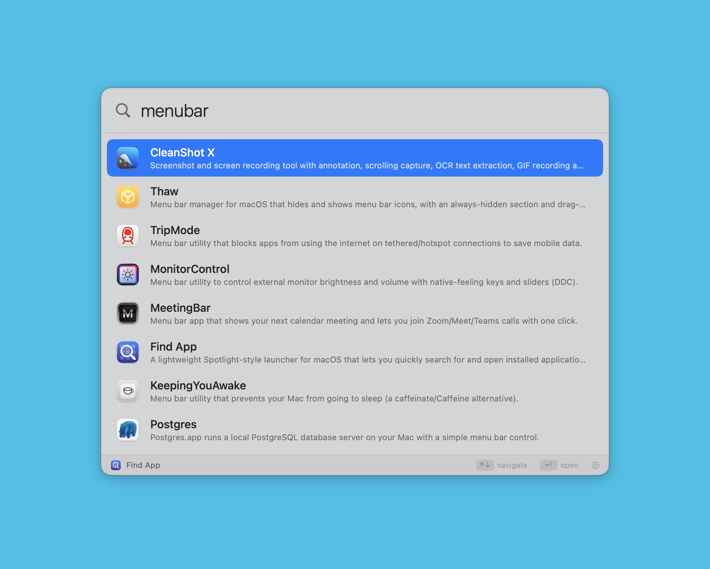
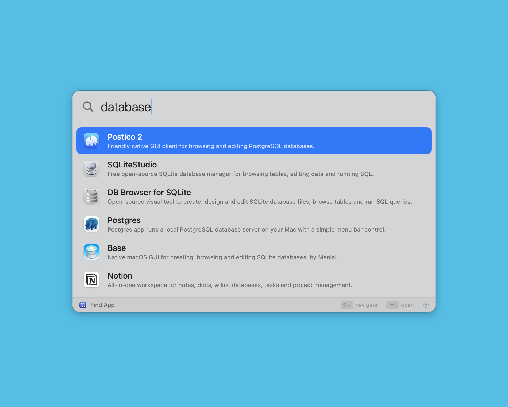
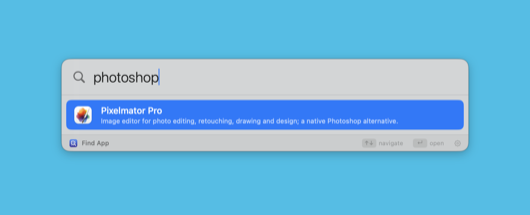
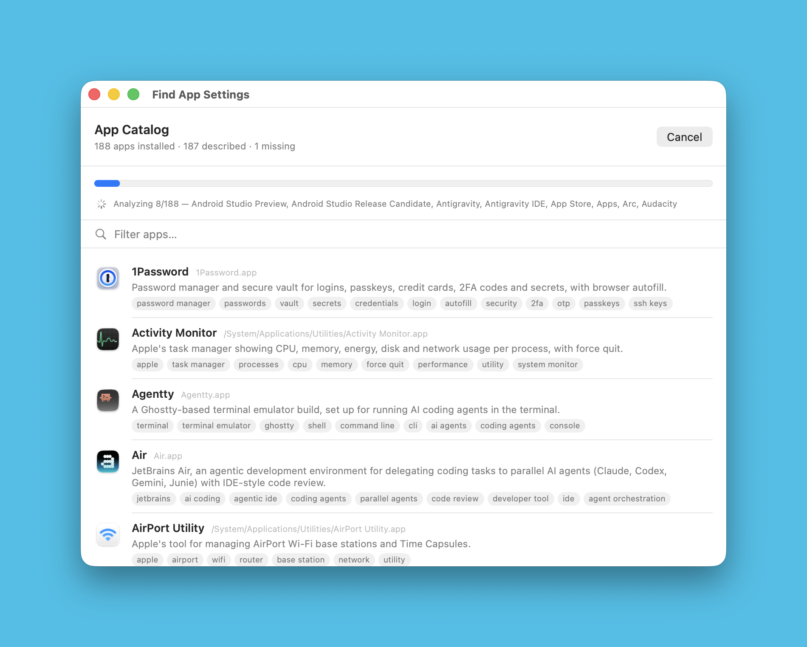
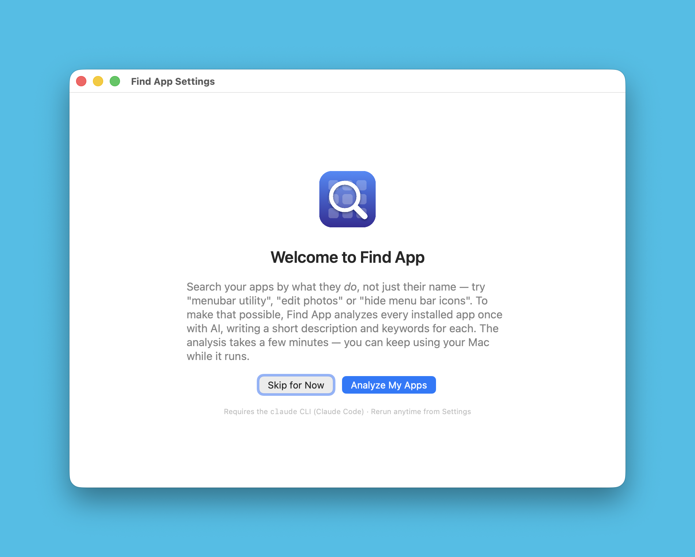

# Find App

A Spotlight/Raycast/Alfred-style launcher for macOS that finds apps by **what
they do**, not what they're called.

I commonly forget the names of apps. [Pixelmator](https://www.apple.com/pixelmator-pro/) I remember as the **"Photoshop
clone"**, [Thaw](https://github.com/thaw-app/Thaw) I don't remember at all (but it is a **"menubar utility"**). I also
have a bunch of **"database GUIs"** but I never remember which. [Rancher Desktop](https://rancherdesktop.io/) I
forget, I can only remember it as the **"Docker app"**.

So I made a Spotlight clone that indexes my Mac apps with Claude CLI. I of course
gave it a stupidly obvious name: **Find App**. 😊 I still use
Spotlight/Raycast, this app is not a replacement, but my app comes in handy once in
a while.

> **Note:** I have not given the app a global shortcut, at least not yet,
> because I don't use it as a replacement for Spotlight/Raycast. I launch it
> manually, find the app and then quit it (because I use it maybe a couple of
> times per week). I might add it in the future, as well as the option of having
> the app as a menubar app instead of in the Dock.

## Screenshots

    

## How it works

- **Catalog**: a JSON index holding an AI-generated description + keyword set
  for every installed app, grounded in each app's bundle id and web research.
  [Resources/catalog.json](Resources/catalog.json) is a small sample showing the
  format; your real one is generated on first run into
  `~/Library/Application Support/FindApp/catalog.json`.
- **Matching**: combines classic name/keyword/prefix scoring with on-device
  semantic matching using Apple's `NaturalLanguage` word- and sentence
  embeddings (no network calls at search time).
- **Scope**: `/Applications` and `~/Applications` (each scanned one folder deep,
  so nested bundles like `Chrome Apps.localized/YouTube.app` are included), plus
  Apple's built-ins in `/System/Applications` and
  `/System/Applications/Utilities`.
- **Freshness**: those locations are rescanned on every keystroke, so removed
  apps never appear and newly added apps still match by name (add descriptions
  by regenerating the catalog in Settings).

## Requirements

- macOS 14+
- The [`claude` CLI](https://claude.com/claude-code) — only for generating the
  catalog, not for searching. The apps are indexed with `claude --prompt ...`

## How to install and use

- **Download:**
- The search field is focused automatically when the app opens/activates.
- **↑/↓** select, **Enter** launches, **Esc** hides, **⌘Q** quits.
- Reopening the app (from Dock/Spotlight/Raycast) brings the panel back.
- On **first launch** (no catalog in Application Support yet) the app opens a
welcome pane offering **Analyze My Apps** / **Skip for Now** — name-based
search works fine until the analysis runs.

### Settings & regenerating the catalog

Open **Settings** (⌘, — or the gear in the search panel's footer) to browse
every installed app with its description and keyword chips, filter them, and
regenerate entries:

- **Generate Missing (n)** — describe apps that have no entry yet.
- **Regenerate All** — rebuild every entry.
- Right-click a row — **Regenerate This App**, **Regenerate with Instructions…**
  or **Show in Finder**.

**Regenerate with Instructions…** opens a sheet where you describe the app
yourself. Your notes are treated as authoritative — above anything the model
knows or finds online — so internal company apps and your own projects get
accurate descriptions and keywords.

## How it runs Claude

Generation spawns your local `claude` CLI (research only — the CLI returns
JSON, the app merges and saves it). Apps are sent in batches of 8, with up to
3 batches running concurrently, and each batch streams its response
(`--output-format stream-json`) so the progress bar advances per app as each
entry finishes rather than per batch.

Results are merged and saved once, after all batches finished regularly — a
cancelled or failed run discards them, and Cancel (or quitting) terminates the
running CLI processes. Each save keeps the previous catalog as a timestamped
backup (`catalog.yyyyMMdd-HHmmss-SSS.backup.json`, newest 5 kept).

Batch size and concurrency come from measurements: 8 apps per call costs ~144
output tokens and ~2s per app, while much larger calls spend proportionally
more thinking per app (~329 tokens and ~3s at 40 apps) — and one call covering
every installed app would approach the model's 64k output-token limit, risking
a truncated run. Three concurrent batches measured ~2.4x faster than
sequential with no rate limiting.

There's also a script route that does the same thing outside the app:

```sh
Scripts/regenerate-catalog.sh
```

Catalog search order: `$FINDAPP_CATALOG` → `~/Library/Application
Support/FindApp/catalog.json` → next to the executable / bundle resources →
`Resources/catalog.json` in the current directory.

## How to build

```sh
swift run                 # run directly

Scripts/build-app.sh      # build "build/Find App.app"
cp -R "build/Find App.app" /Applications/
open -a "Find App.app"
```

## Source structure

```
Sources/FindApp/   app code (search engine, panel UI, app lifecycle)
Resources/         catalog.json — sample index showing the format
Icon/              make-icon.swift — the app icon, drawn in code
Scripts/           build-app.sh, make-icon.sh, regenerate-catalog.sh
build/             generated: "Find App.app", AppIcon.icns (gitignored)
```

The icon is generated from [Icon/make-icon.swift](Icon/make-icon.swift);
`build-app.sh` re-renders it automatically when that file changes.

## Testing

```sh
swift run FindApp --search "mac menubar app"       # test matching quality
swift run FindApp --render-preview out.png "query" # offscreen panel screenshot
swift run FindApp --render-settings out.png        # offscreen settings screenshot ("welcome" for first-run state)
swift run FindApp --selftest-keys                  # key-handling self-test
swift run FindApp --selftest-windows               # window/focus self-test
swift run FindApp --selftest-generate [fileKey|N] [instructions]  # real AI generation: one app, or N apps to exercise parallel batching
swift run FindApp --selftest-generate 24 --cancel-after 10        # verify Cancel kills every batch process and keeps the catalog intact
```

To test the first-run flow, clear the app's user defaults and move the
Application Support catalog aside:

```sh
defaults delete com.johanlunds.FindApp
rm ~/Library/Application\ Support/FindApp/catalog.json
```

